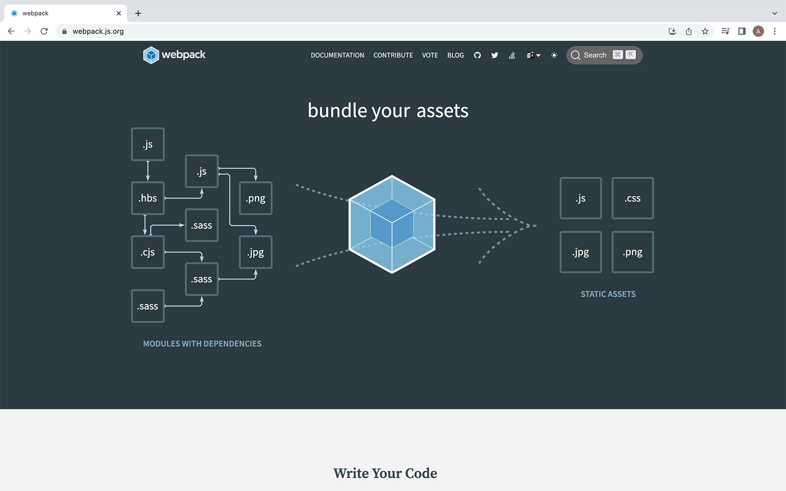
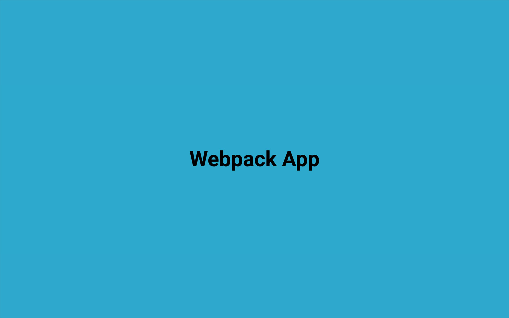

# Webpack | Crash Course

> https://www.youtube.com/watch?v=IZGNcSuwBZs

<br/>

## Intro

> webpack is a module bundler. Its main purpose is to bundle JavaScript files for usage in a browser, yet it is also capable of transforming, bundling, or packaging just about any resource or asset. <br/> https://webpack.js.org/



<br/>

## Initial Files (src/dist)

- create folder dist & src on root
- create index.html in dist folder
- create index.js in src folder

```bash
_root
├── dist
│   └── index.html
└── src
    └── index.js
```

> <i>index.html</i>

```html
<!DOCTYPE html>
<html lang="en">
  <head>
    <meta charset="UTF-8" />
    <meta http-equiv="X-UA-Compatible" content="IE=edge" />
    <meta name="viewport" content="width=device-width, initial-scale=1.0" />
    <title>Webpack | Crash Course</title>
  </head>
  <body>
    <h1>Webpack App</h1>
    <script src="../src/index.js"></script>
  </body>
</html>
```

> <i>index.js</i>

```js
console.log(123);
```

<br/>

## Creating Modules

- create generate-joke.js in src folder
- add generateJoke() function in it and return some joke in string

> <i>generate-joke.js</i>

```js
export default function generateJoke() {
  return "The wedding was so beautiful. Even the cake was in tiers.";
}
```

- in index.js import generateJoke and console log the function

> <i>index.js</i>

```js
import generateJoke from "./generate-joke";
console.log(generateJoke());
```

```bash
# result in browser's console
Uncaught SyntaxError: Cannot use import statement outside a module (at index.js:1:1)
```

<br/>

## Webpack Install & Building

- npm init -y - initialize project without question section in terminal

```bash
npm init -y
```

- install webpack packages

```bash
npm i -D webpack webpack-cli
```

> <i>package.json</i>

```json
{
  "scripts": {
    "build": "webpack --mode production"
  },
  "devDependencies": {
    "webpack": "^5.74.0",
    "webpack-cli": "^4.10.0"
  }
}
```

- compile webpack for the first time

```bash
npm run build
```

- check dist folder and webpack create a new file called main.js

> <i>main.js</i>

```js
//  webpack combine generateJoke() function and console.log() in index.js

(() => {
  "use strict";
  console.log("The wedding was so beautiful. Even the cake was in tiers.");
})();
```

- in index.html replace source script to "./main.js"

> <i>index.html</i> <br/> \<script src="../src/index.js"></script> <br/> ↓ replace src value to main.js

```html
<script src="./main.js"></script>
```

```bash
 # result in browser console
 The wedding was so beautiful. Even the cake was in tiers.
```

<br/>

## Using NPM Modules

- test webpack build with uuid package

```bash
npm i uuid
```

> <i>index.js</i>

```js
import { v4 as uuidv4 } from "uuid";
console.log(uuidv4());
```

```bash
# browser console
9f4ce0d8-b39f-4e2c-987b-9f711deb348e
```

- result to main.js is more complex than before, because it comes from uuid package

> <i>main.js</i>

```js
(() => {
  "use strict";
  var t,
    r = new Uint8Array(16);
  function o() {
    if (!t && !(t = ("undefined" != typeof crypto && crypto.getRandomValues && crypto.getRandomValues.bind(crypto)) || ("undefined" != typeof msCrypto && "function" == typeof msCrypto.getRandomValues && msCrypto.getRandomValues.bind(msCrypto)))) throw new Error("crypto.getRandomValues() not supported. See https://github.com/uuidjs/uuid#getrandomvalues-not-supported");
    return t(r);
  }
  const n = /^(?:[0-9a-f]{8}-[0-9a-f]{4}-[1-5][0-9a-f]{3}-[89ab][0-9a-f]{3}-[0-9a-f]{12}|00000000-0000-0000-0000-000000000000)$/i,
    e = function (t) {
      return "string" == typeof t && n.test(t);
    };
  for (var u = [], a = 0; a < 256; ++a) u.push((a + 256).toString(16).substr(1));
  console.log(
    (function (t, r, n) {
      var a = (t = t || {}).random || (t.rng || o)();
      if (((a[6] = (15 & a[6]) | 64), (a[8] = (63 & a[8]) | 128), r)) {
        n = n || 0;
        for (var i = 0; i < 16; ++i) r[n + i] = a[i];
        return r;
      }
      return (function (t) {
        var r = arguments.length > 1 && void 0 !== arguments[1] ? arguments[1] : 0,
          o = (u[t[r + 0]] + u[t[r + 1]] + u[t[r + 2]] + u[t[r + 3]] + "-" + u[t[r + 4]] + u[t[r + 5]] + "-" + u[t[r + 6]] + u[t[r + 7]] + "-" + u[t[r + 8]] + u[t[r + 9]] + "-" + u[t[r + 10]] + u[t[r + 11]] + u[t[r + 12]] + u[t[r + 13]] + u[t[r + 14]] + u[t[r + 15]]).toLowerCase();
        if (!e(o)) throw TypeError("Stringified UUID is invalid");
        return o;
      })(a);
    })()
  );
})();
```

<br/>

## Webpack Config File

### Webpack Mode

- create webpack.config.js on root
- set mode to development
- remove '--mode' on build script in package.json

> <i>webpack.config.js</i>

```js
module.exports = {
  mode: "development",
};
```

> <i>package.json</i> <br/> "build": "webpack --mode production" <br/> ↓ remove --mode ...

```json

"build": "webpack"
```

### bundle.js

- set entry file to index.js in src folder
- target the outpur to dist named bundle.js

```js
const path = require("path");

module.exports = {
  mode: "development",
  entry: path.resolve(__dirname, "src/index.js"),
  output: {
    path: path.resolve(__dirname, "dist"),
    filename: "bundle.js",
  },
};
```

- remove main.js in dist folder
- npm run build

```bash
npm run build
```

```bash
_root
└── dist
    ├── bundle.js
    └── index.html
```

- replace src='./main.js' to

> <i>index.html</i> <br/> \<script src="./main.js">\</script> <br/> ↓ replace src to "./bundle.js"

```html
<script src="./bundle.js"></script>
```

### Multiple Entry Point

- set multiple entry point with making 'entry' an object
  > entry: { bundle: path.resolve(\_\_dirname, "src/index.js") },
- output the filename based on entry object

```js
module.exports = {
  mode: "development",
  entry: {
    bundle: path.resolve(__dirname, "src/index.js"),
  },
  output: {
    path: path.resolve(__dirname, "dist"),
    filename: "[name].js",
  },
};
```

> \[name\].js pass 'bundle' object in entry <br/> run npm build and get same result in dist folder

<br/>

## Loaders & Sass Compiling

> Loaders - Webpack enables use of loaders to preprocess files. This allows you to bundle any static resource way beyond JavaScript. You can easily write your own loaders using Node.js. <br/> https://webpack.js.org/loaders/

### Install Packages

```bash
npm i -D sass style-loader css-loader sass-loader
```

### main.scss

- create styles folder in src
- add main.scss in it
- copy and paste main.scss from repo
  > https://github.com/bradtraversy/webpack-starter/blob/main/src/styles/main.scss

```bash
_root
└── src
    └── styles
        └── main.scss
```

### Loader Config

- set module config below output

> <i>webpack.config.js</i>

```js
output: {
  // ...
},
module: {
  rules: [
    {
      test: /\.scss$/,
      use: ["style-loader", "css-loader", "sass-loader"],
    },
  ],
},
```

- import main.scss in src/index.js

> <i>index.js</i>

```js
import "./styles/main.scss";
```

```bash
npm run build
```



<br/>

## HTML Webpack Plugin

> HtmlWebpackPlugin - The HtmlWebpackPlugin simplifies creation of HTML files to serve your webpack bundles. This is especially useful for webpack bundles that include a hash in the filename which changes every compilation. You can either let the plugin generate an HTML file for you, supply your own template using lodash templates, or use your own loader. <br/> https://webpack.js.org/plugins/html-webpack-plugin/

### Install Package

```bash
npm i -D html-webpack-plugin
```

### Webpack Config

> <i>webpack.config.js</i>

```js
plugins: [
  new HtmlWebpackPlugin({
    title: "Webpack App | Crash Course",
    filename: "index.html",
  }),
],
```

- delete dist folder and npm run build to test

```bash
npm run build
```

> <i>index.html</i>

```html
<!DOCTYPE html>
<html>
  <head>
    <meta charset="utf-8" />
    <title>Webpack App | Crash Course</title>
    <meta name="viewport" content="width=device-width, initial-scale=1" />
    <script defer src="bundle.js"></script>
  </head>
  <body></body>
</html>
```

<br/>

## HTML Template

- set template in HtmlWebpackPlugin

> <i>webpack.config.js</i>

```js
plugins: [
  new HtmlWebpackPlugin({
    title: "Webpack App | Crash Course",
    filename: "index.html",
    template: "src/template.html",
  }),
],
```

- create template.html file in src folder
- output dynamic title with \<%= htmlWebpackPlugin.options.title \%>

> <i>template.html</i>

```html
<!DOCTYPE html>
<html lang="en">
  <head>
    <meta charset="UTF-8" />
    <meta http-equiv="X-UA-Compatible" content="IE=edge" />
    <meta name="viewport" content="width=device-width, initial-scale=1.0" />
    <title><%= htmlWebpackPlugin.options.title %></title>
  </head>
  <body>
    <div class="container">
      <h3>Don't Laugh Challenge</h3>
      <div id="joke" class="joke"></div>
      <button id="joke-btn" class="btn">Get Another Joke</button>
    </div>
  </body>
</html>
```

```bash
npm run build
```

> <i>index.html</i> <br/> result

```html
<!DOCTYPE html>
<html lang="en">
  <head>
    <meta charset="UTF-8" />
    <meta http-equiv="X-UA-Compatible" content="IE=edge" />
    <meta name="viewport" content="width=device-width, initial-scale=1.0" />
    <title>Webpack App | Crash Course</title>
    <script defer src="bundle.js"></script>
  </head>
  <body>
    <div class="container">
      <h3>Don't Laugh Challenge</h3>
      <div id="joke" class="joke"></div>
      <button id="joke-btn" class="btn">Get Another Joke</button>
    </div>
  </body>
</html>
```


<br/>

## Caching & Hash Setup

> instead of bundle.js, the result will be bundle205199ab45963f6a62ec.js
> <br/> https://webpack.js.org/guides/caching/

- add \[contenthash\] after \[name\]

> <i>webpack.config.js</i>

```js
output: {
  path: path.resolve(__dirname, "dist"),
  filename: "[name][contenthash].js",
},
```

- delete dist folder and npm run build

```bash
npm run build
```

- result "bundle7ed90794d364134cd184.js"

```bash
_root
└── dist
    ├── bundle7ed90794d364134cd184.js
    └── index.html
```

<br/>

## Webpack Dev Server

```js

```

<br/>

## Cleaning Up Hash Files

```js

```

<br/>

## Source Maps

```js

```

<br/>

## Babel Loader

```js

```

<br/>

## Asset Resource Loader

```js

```

<br/>

## Finish The Joke App

```js

```

<br/>

## Webpack Bundle Analyzer

```js

```
